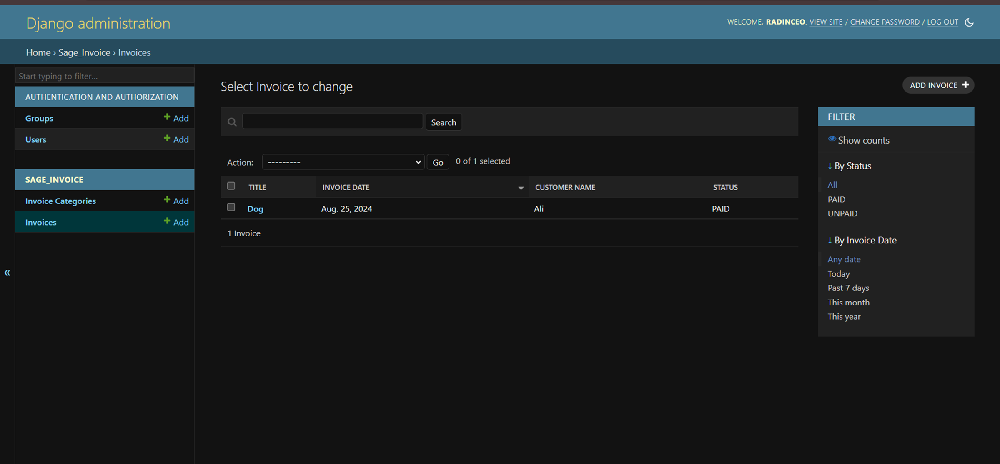
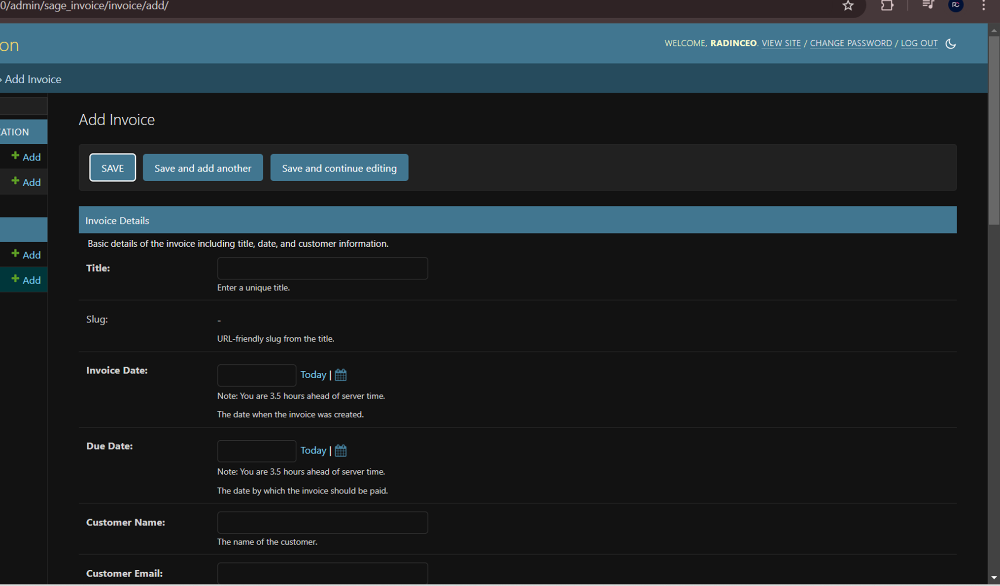
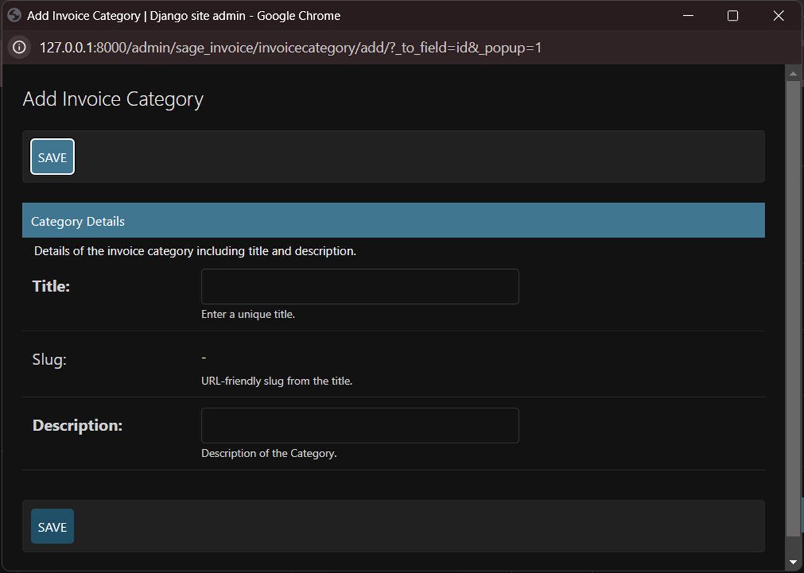
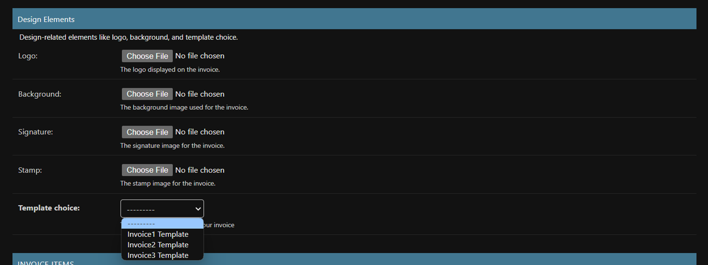
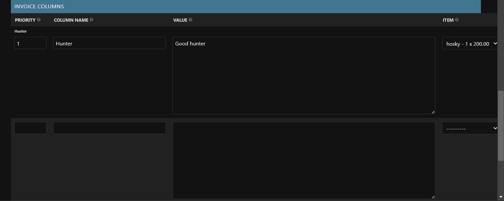
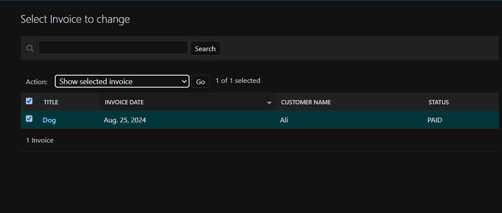
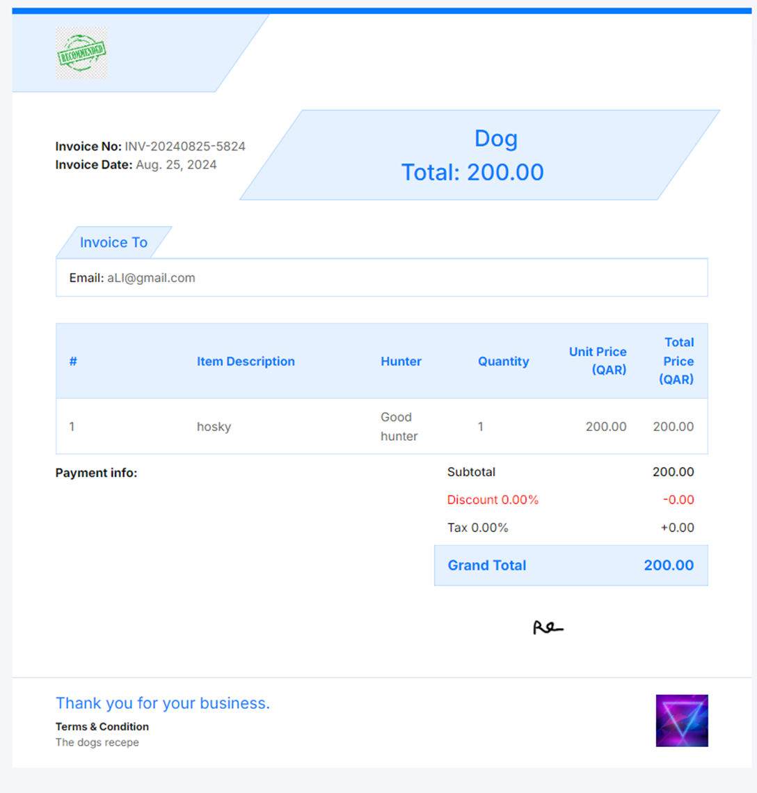
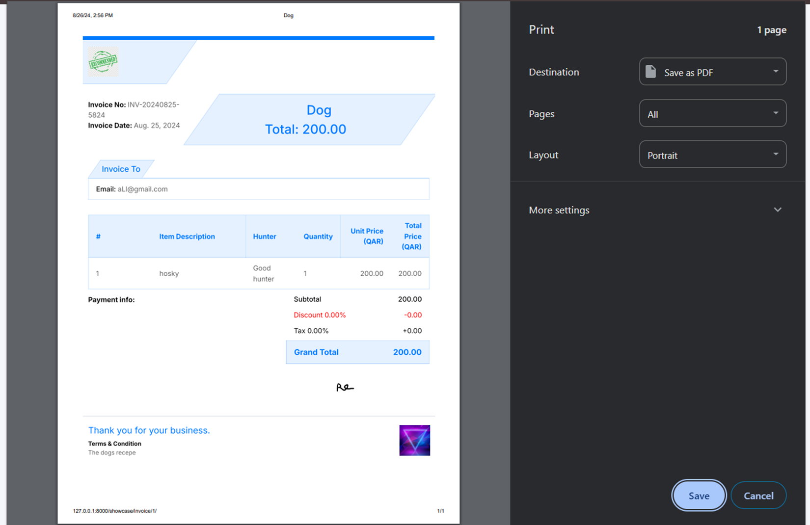
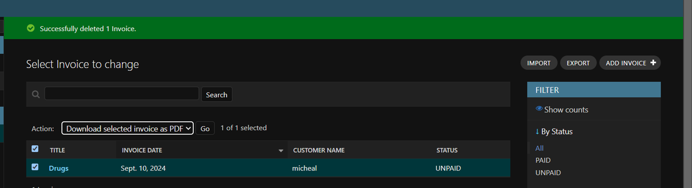

Admin Layer
===========

The admin layer customizes the Django admin interface to manage invoices efficiently. This section explains how to configure and manage invoices and related categories using the Django admin interface.

Managing Invoices
-----------------

In the Django admin interface, you can manage various aspects of invoices, including creating, editing, deleting, and downloading them as PDFs.

Viewing Invoices
----------------

To view the list of invoices:

1. Navigate to the Django admin interface.

This will display a list of all invoices, where you can select and manage them.

Creating a New Invoice
-----------------------

To create a new invoice:

1. Click on the `Add Invoice` button on the top right.
2. Fill in the basic details for the invoice, such as title, date, and customer information.

3. Assign the invoice to a category. If you haven't created a category yet, you need to create one first.

4. Select design elements like logo, background, signature, and stamp.

5. Choose a template for the invoice. The system comes with three pre-defined templates, but you can create your own custom templates as well.

6. After saving the invoice, you can add custom columns to include additional details like delivery date or warranty period.

.. note::
   Custom columns can only be added after the invoice has been created.

Showing an Invoice
------------------

To show the details of an existing invoice:

1. Select an invoice from the list.

2. Choose the `Show selected invoice` action from the dropdown menu.

3. This will display the invoice details in a printable format.

Exporting Invoices
------------------

The Django admin interface allows you to export invoices as HTML files bundled in a ZIP archive, or as PDFs.

Downloading Selected Invoices as PDF
------------------------------------

1. Select one or more invoices from the list.
2. Choose the `Download selected invoices as PDF` action from the dropdown menu.

3. The system will generate the selected invoices in PDF format and download them to your local machine.

.. note::
   If you select more than file it will convert the pdf to zip
